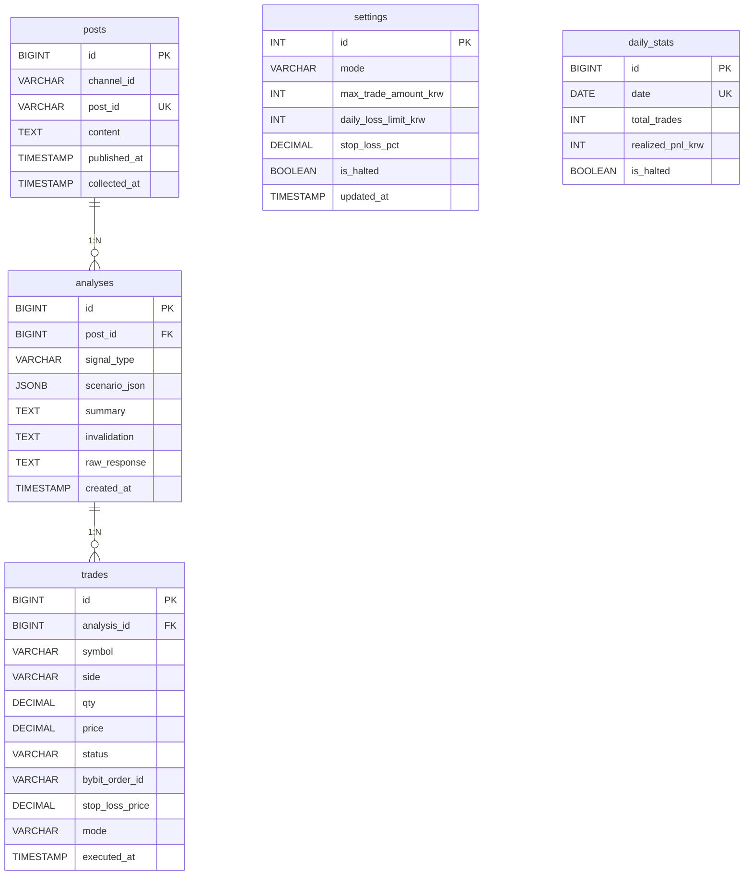

---

- 최종 수정일: 2026.05.08
- 버전: 1차 작성

## 목차

1. 전체 테이블 목록
2. 테이블 컬럼 명세
3. API 명세
4. 테이블 관계도
5. 부록 — 리스크 제어 흐름 / 모드 전환 케이스

---

## 1. 전체 테이블 목록

| 테이블 | 설명 |
| --- | --- |
| `posts` | 수집된 유튜버 멤버십 게시글 원문 |
| `analyses` | GPT-4o 분석 결과 (시나리오 JSON + 요약 + 무효 조건) |
| `trades` | Bybit 매매 실행 내역 (자동 / 수동 구분) |
| `settings` | 시스템 설정 (항상 1행 고정 — 모드 / 리스크 한도) |
| `daily_stats` | 일별 거래 통계 및 손익 집계 |

---

## 2. 테이블 컬럼 명세

### posts — 수집된 게시글

| 컬럼 | 타입 | 설명 |
| --- | --- | --- |
| id | BIGSERIAL PK | 게시글 내부 ID |
| channel_id | VARCHAR(100) | 유튜버 채널 ID |
| post_id | VARCHAR(255) UNIQUE | 유튜브 게시글 고유 ID (Redis 중복 체크 키) |
| content | TEXT | 게시글 원문 텍스트 |
| published_at | TIMESTAMP | 게시글 실제 업로드 시각 |
| collected_at | TIMESTAMP | 시스템 수집 시각 (DEFAULT NOW()) |

### analyses — GPT 분석 결과

| 컬럼 | 타입 | 설명 |
| --- | --- | --- |
| id | BIGSERIAL PK | 분석 내부 ID |
| post_id | BIGINT FK → posts.id | 원본 게시글 참조 |
| signal_type | VARCHAR(10) | `BUY` / `SELL` / `HOLD` |
| scenario_json | JSONB | 단계별 시나리오 구조체 (목표가 / 행동 / 조건 포함) |
| summary | TEXT | 한 줄 요약 |
| invalidation | TEXT | 시나리오 무효 조건 (예: 2,100 이탈 시) |
| raw_response | TEXT | GPT 원본 응답 (디버깅용) |
| created_at | TIMESTAMP | 분석 완료 시각 (DEFAULT NOW()) |

> `scenario_json` 구조 예시:
> ```json
> [
>   { "step": 1, "target_price": 2450, "action": "1차 매도 (부분 실현)", "condition": "2,450 도달 시" },
>   { "step": 2, "target_price": null, "action": "관망",                 "condition": "2,150~2,200 지지 확인" },
>   { "step": 3, "target_price": 2700, "action": "재매수",               "condition": "지지 확인 후" }
> ]
> ```

### trades — 매매 실행 내역

| 컬럼 | 타입 | 설명 |
| --- | --- | --- |
| id | BIGSERIAL PK | 거래 내부 ID |
| analysis_id | BIGINT FK → analyses.id | 근거가 된 분석 참조 |
| symbol | VARCHAR(20) | 코인 심볼 (예: BTCUSDT) |
| side | VARCHAR(10) | `BUY` / `SELL` |
| qty | DECIMAL(18, 8) | 주문 수량 |
| price | DECIMAL(18, 2) | 체결가 (시장가 체결 후 업데이트) |
| status | VARCHAR(20) | `PENDING` / `FILLED` / `FAILED` / `CANCELLED` |
| bybit_order_id | VARCHAR(100) | Bybit 주문 ID (취소 / 조회용) |
| stop_loss_price | DECIMAL(18, 2) | 자동 손절가 (매수 즉시 등록) |
| mode | VARCHAR(20) | `FULL_AUTO` / `SEMI_AUTO` |
| executed_at | TIMESTAMP | 주문 실행 시각 |

### settings — 시스템 설정 (항상 1행)

| 컬럼 | 타입 | 설명 |
| --- | --- | --- |
| id | INT PK | 고정값 1 (다중 행 방지 CHECK 제약) |
| mode | VARCHAR(20) | `FULL_AUTO` / `SEMI_AUTO` (기본: SEMI_AUTO) |
| max_trade_amount_krw | INT | 1회 최대 거래금액 (원, 기본: 100,000) |
| daily_loss_limit_krw | INT | 일일 최대 손실 한도 (원, 기본: 300,000) |
| stop_loss_pct | DECIMAL(5, 4) | 자동 손절 비율 (기본: 0.03 = 3%) |
| is_halted | BOOLEAN | 일일 손실 한도 초과 시 TRUE → 자동 주문 전면 차단 |
| updated_at | TIMESTAMP | 마지막 설정 변경 시각 |

> `is_halted = TRUE` 상태에서는 Full-auto / Semi-auto 모드 관계없이 모든 자동 주문이 차단됨. `/resume` 명령으로만 해제 가능.

### daily_stats — 일별 통계

| 컬럼 | 타입 | 설명 |
| --- | --- | --- |
| id | BIGSERIAL PK | 통계 내부 ID |
| date | DATE UNIQUE | 집계 날짜 |
| total_trades | INT | 당일 총 거래 건수 (기본: 0) |
| realized_pnl_krw | INT | 당일 실현 손익 합계 (원, 음수 = 손실) |
| is_halted | BOOLEAN | 당일 손실 한도 초과로 정지된 적 있으면 TRUE |

---

## 3. API 명세

### 분석 (Analysis)

| 메서드 | 경로 | 설명 | 주요 처리 테이블 |
| --- | --- | --- | --- |
| POST | `/analyze` | 텍스트 수동 입력 → GPT 분석 → 텔레그램 발송 | analyses, posts |
| GET | `/history` | 최근 분석 이력 조회 (기본 5건) | analyses, posts |
| GET | `/history/{id}` | 분석 상세 조회 (시나리오 전체 + 원문) | analyses, posts |

### 매매 (Trading)

| 메서드 | 경로 | 설명 | 주요 처리 테이블 |
| --- | --- | --- | --- |
| GET | `/trades` | 매매 실행 내역 조회 | trades |
| GET | `/trades/{id}` | 거래 상세 조회 | trades, analyses |
| POST | `/trades/{analysis_id}/execute` | 분석 기반 수동 즉시 실행 | trades, settings |

### 시스템 (System)

| 메서드 | 경로 | 설명 | 주요 처리 테이블 |
| --- | --- | --- | --- |
| GET | `/status` | 수집 상태 + 현재 모드 + 오늘 통계 | settings, daily_stats |
| GET | `/settings` | 현재 리스크 설정 조회 | settings |
| PATCH | `/settings` | 리스크 한도 / 모드 변경 | settings |
| POST | `/settings/resume` | is_halted 해제 (정지 상태 수동 복구) | settings |

---

## 4. 테이블 관계도

```
posts (1)
 └── analyses (N)           ← posts.id → analyses.post_id
      └── trades (N)        ← analyses.id → trades.analysis_id

settings (단독)             ← 항상 1행. 모든 매매 서비스가 참조
daily_stats (단독)          ← 날짜별 집계. 거래 완료 시 업데이트
```

### Mermaid ERD



---

## 5. 부록

### 5.1. 리스크 제어 흐름

```
매매 서비스 실행 시
  ↓
① is_halted 확인 → TRUE면 즉시 차단 + 텔레그램 알림
  ↓
② 주문 금액 > max_trade_amount_krw → 차단 + 텔레그램 알림
  ↓
③ 오늘 realized_pnl_krw < -daily_loss_limit_krw → 차단 + is_halted = TRUE + 긴급 알림
  ↓
④ 모든 체크 통과 → Bybit 주문 실행 + 손절 주문 동시 등록 (stop_loss_pct 기준)
  ↓
⑤ trades 테이블 저장 + daily_stats 업데이트
```

### 5.2. 모드 전환 케이스

### 케이스 1 — Semi-auto 모드 (기본)

| 항목 | 상태 |
| --- | --- |
| settings.mode | SEMI_AUTO |
| 게시글 감지 시 | 텔레그램 [확인] [취소] 버튼 발송 |
| 사용자 [확인] 탭 | 리스크 체크 후 Bybit 주문 실행 |
| 사용자 [취소] 탭 또는 10분 타임아웃 | 주문 없이 종료 |

### 케이스 2 — Full-auto 모드 (/work 활성화)

| 항목 | 상태 |
| --- | --- |
| settings.mode | FULL_AUTO |
| 게시글 감지 시 | 사용자 확인 없이 즉시 리스크 체크 → 자동 주문 |
| 실행 후 | 텔레그램으로 실행 결과 알림만 발송 |
| is_halted = TRUE | Full-auto 상태에서도 주문 전면 차단 |

### 케이스 3 — 일일 손실 한도 초과 시

| 항목 | 상태 |
| --- | --- |
| 트리거 | 당일 realized_pnl_krw < -daily_loss_limit_krw |
| 자동 동작 | settings.is_halted = TRUE, daily_stats.is_halted = TRUE |
| 알림 | 긴급 텔레그램 알림 발송 |
| 해제 방법 | `/resume` 명령 또는 `POST /settings/resume` API 직접 호출 |
